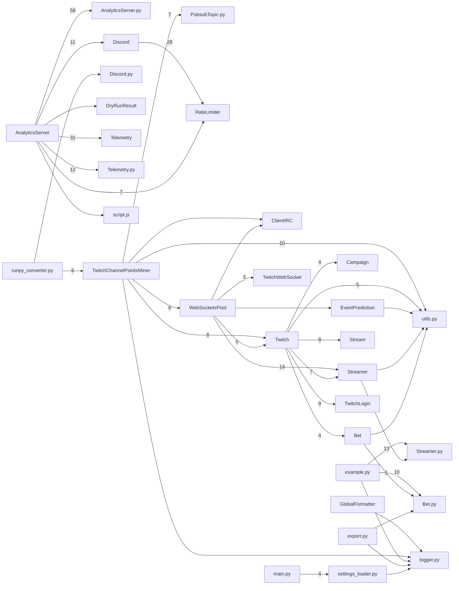

Code map: Twitch-Channel-Points-Miner-v2.1 — 31 components, 40 call-dependencies (top); core: utils.py, RateLimiter.py, Bet.py, Chat.py

_Auto-generated (deterministic, no AI) from the symbol index._

## Core components (PageRank — most depended-upon)
- `utils.py` — 0.052
- `RateLimiter.py` — 0.050
- `Bet.py` — 0.029
- `Chat.py` — 0.028
- `Stream.py` — 0.025
- `Exceptions.py` — 0.024
- `script.js` — 0.023
- `Streamer.py` — 0.022
- `CommunityGoal.py` — 0.022
- `Drop.py` — 0.022
- `TwitchChannelPointsMiner` — 0.022
- `RateLimiter` — 0.021

## Call dependencies (who calls whom)

## Largest components (by member count)
- `Twitch` — 32 members
- `Telemetry` — 28 members
- `Bet` — 24 members
- `Streamer` — 21 members
- `Discord` — 18 members
- `WebSocketsPool` — 13 members
- `Stream` — 13 members
- `TwitchLogin` — 12 members
- `GlobalFormatter` — 9 members
- `TwitchChannelPointsMiner` — 8 members
- `EventPrediction` — 7 members
- `TwitchWebSocket` — 6 members
- `Campaign` — 6 members
- `CommunityGoal` — 6 members
- `Drop` — 6 members
