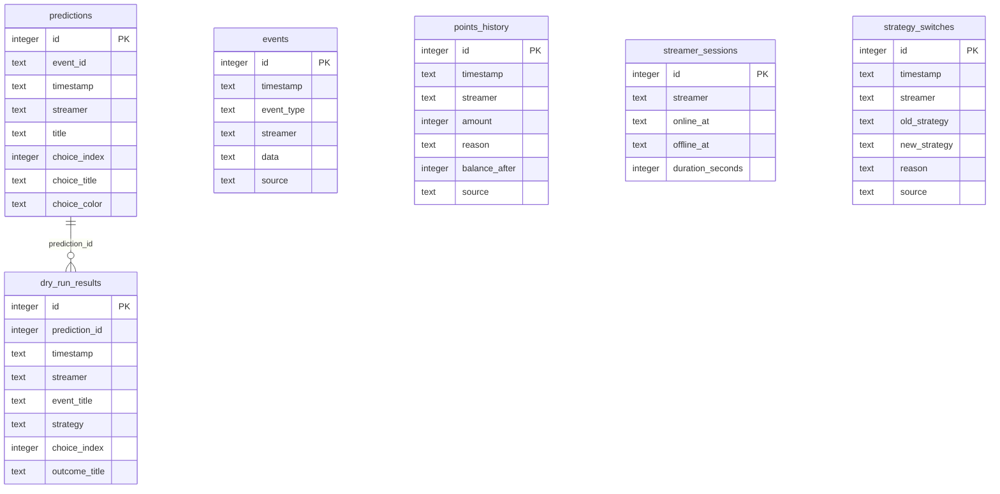

DB map: Twitch-Channel-Points-Miner-v2.1 — 6 tables, 52 columns, 1 FKs across 1 schema files

_Auto-generated (deterministic, no AI) 2026-07-23 · docs/claude-tooling-refresh@3b4d52e._

## Overview
The database models track Twitch channel points and strategies used by users. The `events` table logs various actions like point changes or strategy switches. The `predictions` table stores user guesses about future points. The `dry_run_results` table holds the results of simulations without affecting actual points. The `points_history` table keeps a record of all point transactions over time. The `streamer_sessions` table tracks when users interact with streams, and the `strategy_switches` table logs changes in strategies used by users.

## Engine
- (no docker-compose db service detected)

## Schema (Mermaid ER)

## Tables
### `events`  ·  created `TwitchChannelPointsMiner/classes/Telemetry.py:45`
_Holds information about various events affecting streams._
- PK: id · 6 cols · 0 FK

### `predictions`  ·  created `TwitchChannelPointsMiner/classes/Telemetry.py:54`
_Stores details of predictions and their outcomes._
- PK: id · 14 cols · 0 FK

### `dry_run_results`  ·  created `TwitchChannelPointsMiner/classes/Telemetry.py:72`
_Maps dry run results to original prediction IDs._
- PK: id · 13 cols · 1 FK
- FKs: `prediction_id` → `predictions(id)`

### `points_history`  ·  created `TwitchChannelPointsMiner/classes/Telemetry.py:89`
_Records balance changes with reasons for each transaction._
- PK: id · 7 cols · 0 FK

### `streamer_sessions`  ·  created `TwitchChannelPointsMiner/classes/Telemetry.py:99`
_Logs session durations and online/offline times._
- PK: id · 5 cols · 0 FK

### `strategy_switches`  ·  created `TwitchChannelPointsMiner/classes/Telemetry.py:116`
_Tracks when strategies were changed by streamers._
- PK: id · 7 cols · 0 FK

## Seed / data files
- `TwitchChannelPointsMiner/classes/Telemetry.py` — 12 INSERT statement(s)

## File → schema-object index
- `TwitchChannelPointsMiner/classes/Telemetry.py` — 6× create

## Passive lint
- **convention** `streamer_sessions`: no created_at/updated_at timestamp
