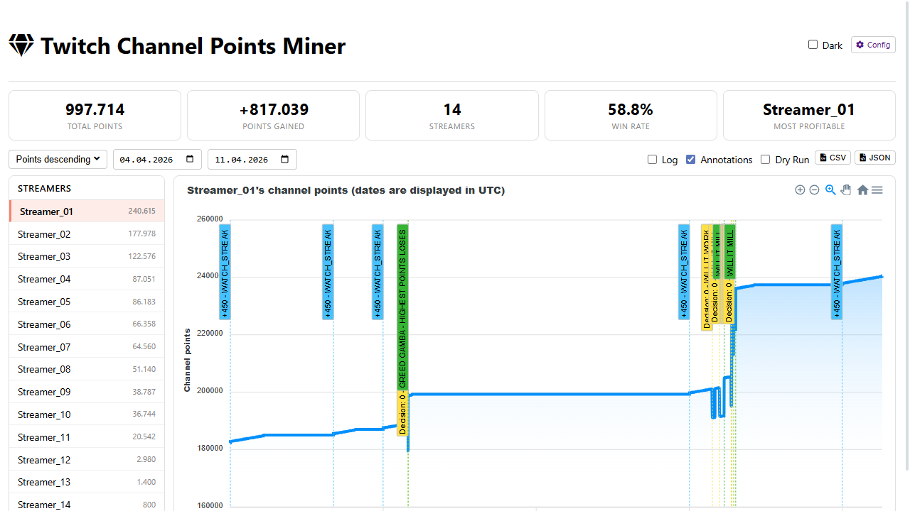
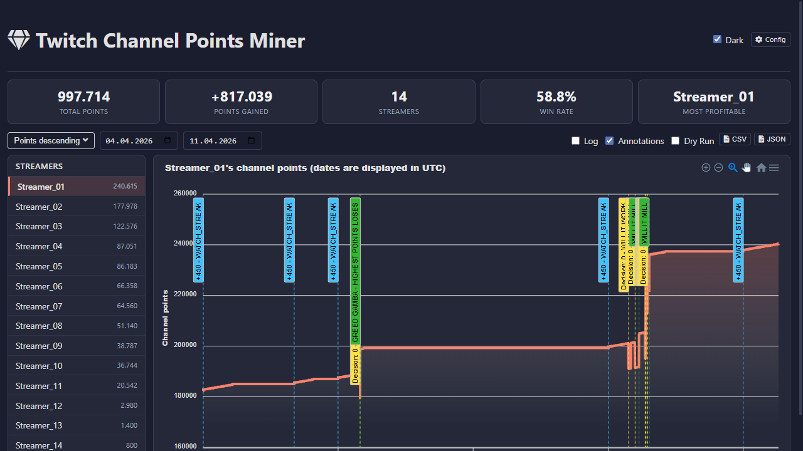
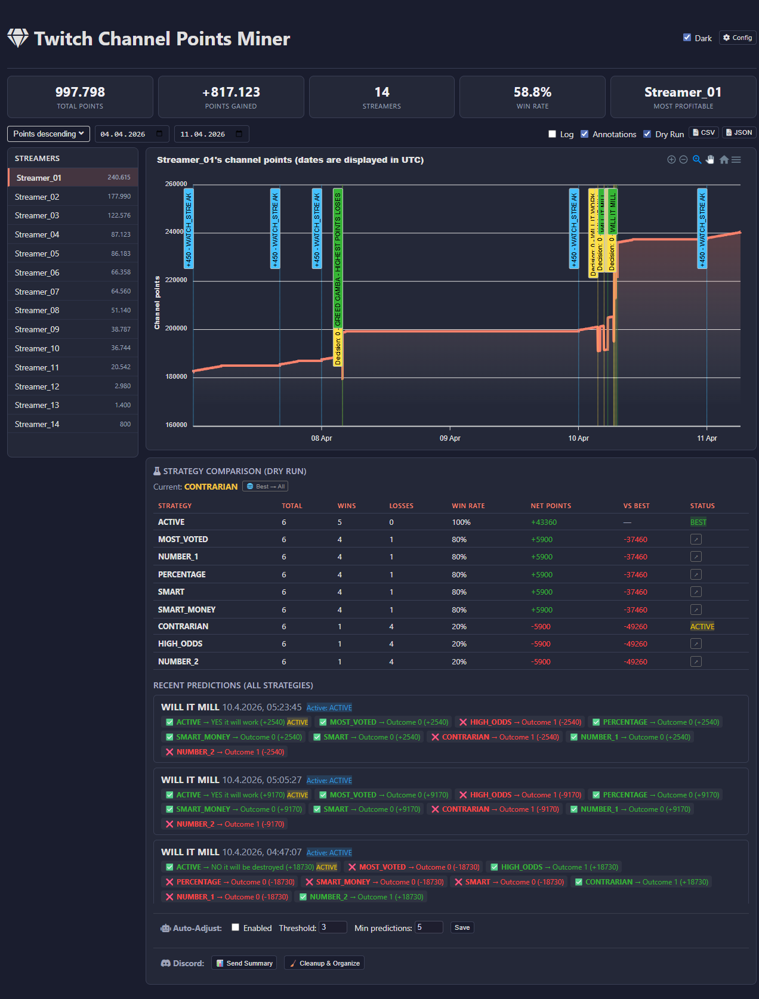
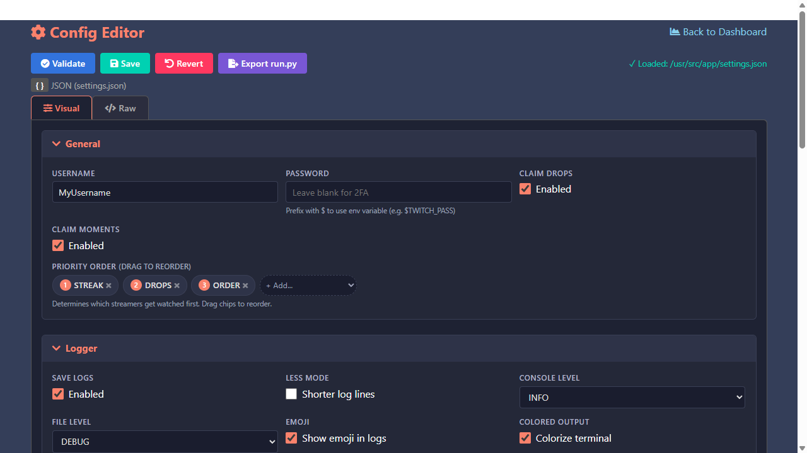

<h1 align="center">Twitch Channel Points Miner v2.1</h1>
<p align="center">
<a href="https://github.com/polo-nyan/Twitch-Channel-Points-Miner-v2.1"></a>
<a href="https://github.com/polo-nyan/Twitch-Channel-Points-Miner-v2.1/blob/master/LICENSE"></a>
<a href="https://github.com/polo-nyan/Twitch-Channel-Points-Miner-v2.1"></a>
</p>

> ⚠️ **AI-Assisted Development Notice**: This fork contains commits generated with the assistance of AI coding agents (GitHub Copilot). While all changes have been reviewed, some code may not have been manually tested in all edge cases. Please review changes carefully before deploying to production. See [AI_NOTICE.md](AI_NOTICE.md) for details.

> A simple script that will watch a stream for you and earn the channel points.

> It can wait for a streamer to go live (+_450 points_ when the stream starts), it will automatically click the bonus button (_+50 points_), and it will follow raids (_+250 points_).

Read more about the channel points [here](https://help.twitch.tv/s/article/channel-points-guide).

<details>
<summary><strong>📜 Original Authors & Credits</strong></summary>

**Upstream Repositories:**
- Original concept: [gottagofaster236/Twitch-Channel-Points-Miner](https://github.com/gottagofaster236/Twitch-Channel-Points-Miner)
- ~~Bet system (Selenium): [ClementRoyer/TwitchAutoCollect-AutoBet](https://github.com/ClementRoyer/TwitchAutoCollect-AutoBet)~~
- v2 rewrite: [Tkd-Alex/Twitch-Channel-Points-Miner-v2](https://github.com/Tkd-Alex/Twitch-Channel-Points-Miner-v2)
- v2 fork by rdavydov: [rdavydov/Twitch-Channel-Points-Miner-v2](https://github.com/rdavydov/Twitch-Channel-Points-Miner-v2)

**Donations (original maintainers):**
| | |
|---|---|
|<a href="https://bitcoin.org" target="_blank"></a>|`bc1qq49mvgda2zw4f9kta0a85xztwuxewqwac5eckd` _(BTC - rdavydov)_|
|<a href="https://dogechain.info" target="_blank"></a>|`DAKzncwKkpfPCm1xVU7u2pConpXwX7HS3D` _(DOGE - rdavydov)_|
|<a href="https://www.donationalerts.com/r/rdavydov" target="_blank"></a>|https://www.donationalerts.com/r/rdavydov|
|<a href="https://boosty.to/rdavydov/donate" target="_blank"></a>|https://boosty.to/rdavydov/donate|

</details>

# README Contents
1. 🤝 [Community](#community)
2. 🚀 [What's New in v2.1](#whats-new-in-v21)
3. 🔧 [Original v2 Features](#original-v2-features)
4. 🧾 [Logs feature](#logs-feature)
    - [Full logs](#full-logs)
    - [Less logs](#less-logs)
    - [Final report](#final-report)
5. 🧐 [How to use](#how-to-use)
    - [Cloning](#by-cloning-the-repository)
    - [Docker](#docker)
    	- [Docker Hub](#docker-hub)
		- [Portainer](#portainer)
    - [Replit](#replit)
    - [Limits](#limits)
6. 🔧 [Settings](#settings)
    - [LoggerSettings](#loggersettings)
    - [StreamerSettings](#streamersettings)
    - [BetSettings](#betsettings)
        - [Bet strategy](#bet-strategy)
    - [FilterCondition](#filtercondition)
        - [Example](#example)
7. 📈 [Analytics](#analytics)
    - [Strategy Advisor (Dry-Run Comparison)](#strategy-advisor-dry-run-comparison)
    - [Web Config Editor](#web-config-editor)
    - [Discord Logbook](#discord-logbook)
    - [Telemetry & Backup](#telemetry--backup)
8. 🍪 [Migrating from an old repository (the original one)](#migrating-from-an-old-repository-the-original-one)
9. 🪟 [Windows](#windows)
10. 📱 [Termux](#termux)
11. ⚠️ [Disclaimer](#disclaimer)


## Community
If you want to help with this project, please leave a star 🌟 and share it with your friends! 😎

If you have any issues or you want to contribute, you are welcome! Please open an issue or PR on this repository.

## What's New in v2.1

This fork adds significant new features on top of the upstream v2:

- 🔮 **Dry-Run Strategy Comparison** — Shadow-evaluates all available strategies on every prediction, scores them after resolution, and shows a ranked comparison table in the web dashboard ✔️
- 📊 **HISTORICAL Strategy** — Weighs historical outcome win rates (60%) with current odds (40%). Falls back to SMART when no history is available. Requires `enable_analytics=True` ✔️
- 🗄️ **SQLite Telemetry** — All predictions, points events, and session data are persisted in `analytics/telemetry.db` with full historical recall ✔️
- 🎯 **Per-Channel Strategy Switching** — Click any strategy in the dry-run table to switch a specific channel to that strategy at runtime without restarting ✔️
- 🤖 **Auto-Adjust Strategy** — Automatically switches a channel to the best-performing strategy if it falls below a configurable win-rate threshold ✔️
- 📖 **Discord Logbook** — Sends one persistent embed per channel to Discord; subsequent calls *edit* that same message so your feed stays clean instead of flooding with individual events ✔️
- 💬 **Discord Rich Embeds** — Upgraded from plain text to rich embeds with event-specific colors, icons, timestamps, and streamer info ✔️
- 🔇 **Discord Mute System** — Mute notifications per-channel, per-event, or globally (e.g., silence all `GAIN_FOR_WATCH` or mute a specific streamer) ✔️
- ⚙️ **Web Config Editor** — Edit your `settings.json` config directly in the browser with visual form fields, syntax validation, save with backup, and revert ✔️
- 🌙 **Dark Mode Analytics** — Toggle dark/light theme in the analytics dashboard ✔️
- 💾 **Telemetry Export/Import** — Export the SQLite database or a full JSON dump from the dashboard; re-import for backup/restore ✔️
- 🔄 **Config Hot-Reload** — The miner watches `settings.json` for changes and applies them without restarting ✔️
- 🤖 **AI Notice** — Transparency about AI-assisted development ✔️

## Original v2 Features

- Improved logging: emojis, colors, files and much more ✔️
- Final report with all the data ✔️
- Rewritten codebase now uses classes instead of modules with global variables ✔️
- Automatic downloading of the list of followers and using it as an input ✔️
- Better 'Watch Streak' strategy in the priority system [#11](https://github.com/Tkd-Alex/Twitch-Channel-Points-Miner-v2/issues/11) ✔️
- Auto claiming [game drops](https://help.twitch.tv/s/article/mission-based-drops) from the Twitch inventory [#21](https://github.com/Tkd-Alex/Twitch-Channel-Points-Miner-v2/issues/21) ✔️
- Placing a bet / making a prediction with your channel points [#41](https://github.com/Tkd-Alex/Twitch-Channel-Points-Miner-v2/issues/41) ([@lay295](https://github.com/lay295)) ✔️
- Switchable analytics chart that shows the progress of your points with various annotations [#96](https://github.com/Tkd-Alex/Twitch-Channel-Points-Miner-v2/issues/96) ✔️
- Joining the IRC Chat to increase the watch time and get StreamElements points [#47](https://github.com/Tkd-Alex/Twitch-Channel-Points-Miner-v2/issues/47) ✔️
- [Moments](https://help.twitch.tv/s/article/moments) claiming [#182](https://github.com/rdavydov/Twitch-Channel-Points-Miner-v2/issues/182) ✔️
- Notifying on `@nickname` mention in the Twitch chat [#227](https://github.com/rdavydov/Twitch-Channel-Points-Miner-v2/issues/227) ✔️

## Logs feature
### Full logs
```
%d/%m/%y %H:%M:%S - INFO - [run]: 💣  Start session: '9eb934b0-1684-4a62-b3e2-ba097bd67d35'
%d/%m/%y %H:%M:%S - INFO - [run]: 🤓  Loading data for x streamers. Please wait ...
%d/%m/%y %H:%M:%S - INFO - [set_offline]: 😴  Streamer(username=streamer-username1, channel_id=0000000, channel_points=67247) is Offline!
%d/%m/%y %H:%M:%S - INFO - [set_offline]: 😴  Streamer(username=streamer-username2, channel_id=0000000, channel_points=4240) is Offline!
%d/%m/%y %H:%M:%S - INFO - [set_offline]: 😴  Streamer(username=streamer-username3, channel_id=0000000, channel_points=61365) is Offline!
%d/%m/%y %H:%M:%S - INFO - [set_offline]: 😴  Streamer(username=streamer-username4, channel_id=0000000, channel_points=3760) is Offline!
%d/%m/%y %H:%M:%S - INFO - [set_online]: 🥳  Streamer(username=streamer-username, channel_id=0000000, channel_points=61365) is Online!
%d/%m/%y %H:%M:%S - INFO - [start_bet]: 🔧  Start betting for EventPrediction(event_id=xxxx-xxxx-xxxx-xxxx, title=Please star this repo) owned by Streamer(username=streamer-username, channel_id=0000000, channel_points=61365)
%d/%m/%y %H:%M:%S - INFO - [__open_coins_menu]: 🔧  Open coins menu for EventPrediction(event_id=xxxx-xxxx-xxxx-xxxx, title=Please star this repo)
%d/%m/%y %H:%M:%S - INFO - [__click_on_bet]: 🔧  Click on the bet for EventPrediction(event_id=xxxx-xxxx-xxxx-xxxx, title=Please star this repo)
%d/%m/%y %H:%M:%S - INFO - [__enable_custom_bet_value]: 🔧  Enable input of custom value for EventPrediction(event_id=xxxx-xxxx-xxxx-xxxx, title=Please star this repo)
%d/%m/%y %H:%M:%S - INFO - [on_message]: ⏰  Place the bet after: 89.99s for: EventPrediction(event_id=xxxx-xxxx-xxxx-xxxx-15c61914ef69, title=Please star this repo)
%d/%m/%y %H:%M:%S - INFO - [on_message]: 🚀  +12 → Streamer(username=streamer-username, channel_id=0000000, channel_points=61377) - Reason: WATCH.
%d/%m/%y %H:%M:%S - INFO - [make_predictions]: 🍀  Going to complete bet for EventPrediction(event_id=xxxx-xxxx-xxxx-xxxx-15c61914ef69, title=Please star this repo) owned by Streamer(username=streamer-username, channel_id=0000000, channel_points=61377)
%d/%m/%y %H:%M:%S - INFO - [make_predictions]: 🍀  Place 5k channel points on: SI (BLUE), Points: 848k, Users: 190 (70.63%), Odds: 1.24 (80.65%)
%d/%m/%y %H:%M:%S - INFO - [on_message]: 🚀  +6675 → Streamer(username=streamer-username, channel_id=0000000, channel_points=64206) - Reason: PREDICTION.
%d/%m/%y %H:%M:%S - INFO - [on_message]: 📊  EventPrediction(event_id=xxxx-xxxx-xxxx-xxxx, title=Please star this repo) - Result: WIN, Points won: 6675
%d/%m/%y %H:%M:%S - INFO - [on_message]: 🚀  +12 → Streamer(username=streamer-username, channel_id=0000000, channel_points=64218) - Reason: WATCH.
%d/%m/%y %H:%M:%S - INFO - [on_message]: 🚀  +12 → Streamer(username=streamer-username, channel_id=0000000, channel_points=64230) - Reason: WATCH.
%d/%m/%y %H:%M:%S - INFO - [claim_bonus]: 🎁  Claiming the bonus for Streamer(username=streamer-username, channel_id=0000000, channel_points=64230)!
%d/%m/%y %H:%M:%S - INFO - [on_message]: 🚀  +60 → Streamer(username=streamer-username, channel_id=0000000, channel_points=64290) - Reason: CLAIM.
%d/%m/%y %H:%M:%S - INFO - [on_message]: 🚀  +12 → Streamer(username=streamer-username, channel_id=0000000, channel_points=64326) - Reason: WATCH.
%d/%m/%y %H:%M:%S - INFO - [on_message]: 🚀  +400 → Streamer(username=streamer-username, channel_id=0000000, channel_points=64326) - Reason: WATCH_STREAK.
%d/%m/%y %H:%M:%S - INFO - [claim_bonus]: 🎁  Claiming the bonus for Streamer(username=streamer-username, channel_id=0000000, channel_points=64326)!
%d/%m/%y %H:%M:%S - INFO - [on_message]: 🚀  +60 → Streamer(username=streamer-username, channel_id=0000000, channel_points=64386) - Reason: CLAIM.
%d/%m/%y %H:%M:%S - INFO - [on_message]: 🚀  +12 → Streamer(username=streamer-username, channel_id=0000000, channel_points=64398) - Reason: WATCH.
%d/%m/%y %H:%M:%S - INFO - [update_raid]: 🎭  Joining raid from Streamer(username=streamer-username, channel_id=0000000, channel_points=64398) to another-username!
%d/%m/%y %H:%M:%S - INFO - [on_message]: 🚀  +250 → Streamer(username=streamer-username, channel_id=0000000, channel_points=6845) - Reason: RAID.
```
### Less logs
```
%d/%m %H:%M:%S - 💣  Start session: '9eb934b0-1684-4a62-b3e2-ba097bd67d35'
%d/%m %H:%M:%S - 🤓  Loading data for 13 streamers. Please wait ...
%d/%m %H:%M:%S - 😴  streamer-username1 (xxx points) is Offline!
%d/%m %H:%M:%S - 😴  streamer-username2 (xxx points) is Offline!
%d/%m %H:%M:%S - 😴  streamer-username3 (xxx points) is Offline!
%d/%m %H:%M:%S - 😴  streamer-username4 (xxx points) is Offline!
%d/%m %H:%M:%S - 🥳  streamer-username (xxx points) is Online!
%d/%m %H:%M:%S - 🔧  Start betting for EventPrediction: Please star this repo owned by streamer-username (xxx points)
%d/%m %H:%M:%S - 🔧  Open coins menu for EventPrediction: Please star this repo
%d/%m %H:%M:%S - 🔧  Click on the bet for EventPrediction: Please star this repo
%d/%m %H:%M:%S - 🔧  Enable input of custom value for EventPrediction: Please star this repo
%d/%m %H:%M:%S - ⏰  Place the bet after: 89.99s EventPrediction: Please star this repo
%d/%m %H:%M:%S - 🚀  +12 → streamer-username (xxx points) - Reason: WATCH.
%d/%m %H:%M:%S - 🍀  Going to complete bet for EventPrediction: Please star this repo owned by streamer-username (xxx points)
%d/%m %H:%M:%S - 🍀  Place 5k channel points on: SI (BLUE), Points: 848k, Users: 190 (70.63%), Odds: 1.24 (80.65%)
%d/%m %H:%M:%S - 🚀  +6675 → streamer-username (xxx points) - Reason: PREDICTION.
%d/%m %H:%M:%S - 📊  EventPrediction: Please star this repo - Result: WIN, Points won: 6675
%d/%m %H:%M:%S - 🚀  +12 → streamer-username (xxx points) - Reason: WATCH.
%d/%m %H:%M:%S - 🚀  +12 → streamer-username (xxx points) - Reason: WATCH.
%d/%m %H:%M:%S - 🚀  +60 → streamer-username (xxx points) - Reason: CLAIM.
%d/%m %H:%M:%S - 🚀  +12 → streamer-username (xxx points) - Reason: WATCH.
%d/%m %H:%M:%S - 🚀  +400 → streamer-username (xxx points) - Reason: WATCH_STREAK.
%d/%m %H:%M:%S - 🚀  +60 → streamer-username (xxx points) - Reason: CLAIM.
%d/%m %H:%M:%S - 🚀  +12 → streamer-username (xxx points) - Reason: WATCH.
%d/%m %H:%M:%S - 🎭  Joining raid from streamer-username (xxx points) to another-username!
%d/%m %H:%M:%S - 🚀  +250 → streamer-username (xxx points) - Reason: RAID.
```
### Final report:
```
%d/%m/%y %H:%M:%S - 🛑  End session 'f738d438-cdbc-4cd5-90c4-1517576f1299'
%d/%m/%y %H:%M:%S - 📄  Logs file: /.../path/Twitch-Channel-Points-Miner-v2/logs/username.timestamp.log
%d/%m/%y %H:%M:%S - ⌛  Duration 10:29:19.547371

%d/%m/%y %H:%M:%S - 📊  BetSettings(Strategy=Strategy.SMART, Percentage=7, PercentageGap=20, MaxPoints=7500
%d/%m/%y %H:%M:%S - 📊  EventPrediction(event_id=xxxx-xxxx-xxxx-xxxx, title="Event Title1")
		Streamer(username=streamer-username, channel_id=0000000, channel_points=67247)
		Bet(TotalUsers=1k, TotalPoints=11M), Decision={'choice': 'B', 'amount': 5289, 'id': 'xxxx-yyyy-zzzz'})
		Outcome0(YES (BLUE) Points: 7M, Users: 641 (58.49%), Odds: 1.6, (5}%)
		Outcome1(NO (PINK),Points: 4M, Users: 455 (41.51%), Odds: 2.65 (37.74%))
		Result: {'type': 'LOSE', 'won': 0}
%d/%m/%y %H:%M:%S - 📊  EventPrediction(event_id=yyyy-yyyy-yyyy-yyyy, title="Event Title2")
		Streamer(username=streamer-username, channel_id=0000000, channel_points=3453464)
		Bet(TotalUsers=921, TotalPoints=11M), Decision={'choice': 'A', 'amount': 4926, 'id': 'xxxx-yyyy-zzzz'})
		Outcome0(YES (BLUE) Points: 9M, Users: 562 (61.02%), Odds: 1.31 (76.34%))
		Outcome1(YES (PINK) Points: 3M, Users: 359 (38.98%), Odds: 4.21 (23.75%))
		Result: {'type': 'WIN', 'won': 6531}
%d/%m/%y %H:%M:%S - 📊  EventPrediction(event_id=ad152117-251b-4666-b683-18e5390e56c3, title="Event Title3")
		Streamer(username=streamer-username, channel_id=0000000, channel_points=45645645)
		Bet(TotalUsers=260, TotalPoints=3M), Decision={'choice': 'A', 'amount': 5054, 'id': 'xxxx-yyyy-zzzz'})
		Outcome0(YES (BLUE) Points: 689k, Users: 114 (43.85%), Odds: 4.24 (23.58%))
		Outcome1(NO (PINK) Points: 2M, Users: 146 (56.15%), Odds: 1.31 (76.34%))
		Result: {'type': 'LOSE', 'won': 0}

%d/%m/%y %H:%M:%S - 🤖  Streamer(username=streamer-username, channel_id=0000000, channel_points=67247), Total points gained (after farming - before farming): -7838
%d/%m/%y %H:%M:%S - 💰  CLAIM(11 times, 550 gained), PREDICTION(1 times, 6531 gained), WATCH(35 times, 350 gained)
%d/%m/%y %H:%M:%S - 🤖  Streamer(username=streamer-username2, channel_id=0000000, channel_points=61365), Total points gained (after farming - before farming): 977
%d/%m/%y %H:%M:%S - 💰  CLAIM(4 times, 240 gained), REFUND(1 times, 605 gained), WATCH(11 times, 132 gained)
%d/%m/%y %H:%M:%S - 🤖  Streamer(username=streamer-username5, channel_id=0000000, channel_points=25960), Total points gained (after farming - before farming): 1680
%d/%m/%y %H:%M:%S - 💰  CLAIM(17 times, 850 gained), WATCH(53 times, 530 gained)
%d/%m/%y %H:%M:%S - 🤖  Streamer(username=streamer-username6, channel_id=0000000, channel_points=9430), Total points gained (after farming - before farming): 1120
%d/%m/%y %H:%M:%S - 💰  CLAIM(14 times, 700 gained), WATCH(42 times, 420 gained), WATCH_STREAK(1 times, 450 gained)
```

## How to use:
First of all please create a run.py file. You can just copy [example.py](https://github.com/rdavydov/Twitch-Channel-Points-Miner-v2/blob/master/example.py) and modify it according to your needs.
```python
# -*- coding: utf-8 -*-

import logging
from colorama import Fore
from TwitchChannelPointsMiner import TwitchChannelPointsMiner
from TwitchChannelPointsMiner.logger import LoggerSettings, ColorPalette
from TwitchChannelPointsMiner.classes.Chat import ChatPresence
from TwitchChannelPointsMiner.classes.Discord import Discord
from TwitchChannelPointsMiner.classes.Webhook import Webhook
from TwitchChannelPointsMiner.classes.Telegram import Telegram
from TwitchChannelPointsMiner.classes.Gotify import Gotify
from TwitchChannelPointsMiner.classes.Settings import Priority, Events, FollowersOrder
from TwitchChannelPointsMiner.classes.entities.Bet import Strategy, BetSettings, Condition, OutcomeKeys, FilterCondition, DelayMode
from TwitchChannelPointsMiner.classes.entities.Streamer import Streamer, StreamerSettings

twitch_miner = TwitchChannelPointsMiner(
    username="your-twitch-username",
    password="write-your-secure-psw",           # If no password will be provided, the script will ask interactively
    claim_drops_startup=False,                  # If you want to auto claim all drops from Twitch inventory on the startup
    priority=[                                  # Custom priority in this case for example:
        Priority.STREAK,                        # - We want first of all to catch all watch streak from all streamers
        Priority.DROPS,                         # - When we don't have anymore watch streak to catch, wait until all drops are collected over the streamers
        Priority.ORDER                          # - When we have all of the drops claimed and no watch-streak available, use the order priority (POINTS_ASCENDING, POINTS_DESCENDING)
    ],
    enable_analytics=False,			# Disables Analytics if False. Disabling it significantly reduces memory consumption
    disable_ssl_cert_verification=False,	# Set to True at your own risk and only to fix SSL: CERTIFICATE_VERIFY_FAILED error
    disable_at_in_nickname=False,               # Set to True if you want to check for your nickname mentions in the chat even without @ sign
    logger_settings=LoggerSettings(
        save=True,                              # If you want to save logs in a file (suggested)
        console_level=logging.INFO,             # Level of logs - use logging.DEBUG for more info
        console_username=False,                 # Adds a username to every console log line if True. Also adds it to Telegram, Discord, etc. Useful when you have several accounts
        auto_clear=True,                        # Create a file rotation handler with interval = 1D and backupCount = 7 if True (default)
        time_zone="",                           # Set a specific time zone for console and file loggers. Use tz database names. Example: "America/Denver"
        file_level=logging.DEBUG,               # Level of logs - If you think the log file it's too big, use logging.INFO
        emoji=True,                             # On Windows, we have a problem printing emoji. Set to false if you have a problem
        less=False,                             # If you think that the logs are too verbose, set this to True
        colored=True,                           # If you want to print colored text
        color_palette=ColorPalette(             # You can also create a custom palette color (for the common message).
            STREAMER_online="GREEN",            # Don't worry about lower/upper case. The script will parse all the values.
            streamer_offline="red",             # Read more in README.md
            BET_wiN=Fore.MAGENTA                # Color allowed are: [BLACK, RED, GREEN, YELLOW, BLUE, MAGENTA, CYAN, WHITE, RESET].
        ),
        telegram=Telegram(                                                          # You can omit or set to None if you don't want to receive updates on Telegram
            chat_id=123456789,                                                      # Chat ID to send messages @getmyid_bot
            token="123456789:shfuihreuifheuifhiu34578347",                          # Telegram API token @BotFather
            events=[Events.STREAMER_ONLINE, Events.STREAMER_OFFLINE,
                    Events.BET_LOSE, Events.CHAT_MENTION],                          # Only these events will be sent to the chat
            disable_notification=True,                                              # Revoke the notification (sound/vibration)
        ),
        discord=Discord(
            webhook_api="https://discord.com/api/webhooks/0123456789/0a1B2c3D4e5F6g7H8i9J",  # Discord Webhook URL
            events=[Events.STREAMER_ONLINE, Events.STREAMER_OFFLINE,
                    Events.BET_LOSE, Events.CHAT_MENTION],					                         # Only these events will be sent to the chat
        ),
        webhook=Webhook(
            endpoint="https://example.com/webhook",                                                                    # Webhook URL
            method="GET",                                                                   # GET or POST
            events=[Events.STREAMER_ONLINE, Events.STREAMER_OFFLINE,
                    Events.BET_LOSE, Events.CHAT_MENTION],                                  # Only these events will be sent to the endpoint
        ),
        matrix=Matrix(
            username="twitch_miner",                                                   # Matrix username (without homeserver)
            password="...",                                                            # Matrix password
            homeserver="matrix.org",                                                   # Matrix homeserver
            room_id="...",                                                             # Room ID
            events=[Events.STREAMER_ONLINE, Events.STREAMER_OFFLINE, Events.BET_LOSE], # Only these events will be sent
        ),
        pushover=Pushover(
            userkey="YOUR-ACCOUNT-TOKEN",                                             # Login to https://pushover.net/, the user token is on the main page
            token="YOUR-APPLICATION-TOKEN",                                           # Create a application on the website, and use the token shown in your application
            priority=0,                                                               # Read more about priority here: https://pushover.net/api#priority
            sound="pushover",                                                         # A list of sounds can be found here: https://pushover.net/api#sounds
            events=[Events.CHAT_MENTION, Events.DROP_CLAIM],                          # Only these events will be sent
        ),
        gotify=Gotify(
            endpoint="https://example.com/message?token=TOKEN",
            priority=8,
            events=[Events.STREAMER_ONLINE, Events.STREAMER_OFFLINE,
                    Events.BET_LOSE, Events.CHAT_MENTION], 
        )
    ),
    streamer_settings=StreamerSettings(
        make_predictions=True,                  # If you want to Bet / Make prediction
        follow_raid=True,                       # Follow raid to obtain more points
        claim_drops=True,                       # We can't filter rewards base on stream. Set to False for skip viewing counter increase and you will never obtain a drop reward from this script. Issue #21
        claim_moments=True,                     # If set to True, https://help.twitch.tv/s/article/moments will be claimed when available
        watch_streak=True,                      # If a streamer go online change the priority of streamers array and catch the watch screak. Issue #11
        community_goals=False,                  # If True, contributes the max channel points per stream to the streamers' community challenge goals
        chat=ChatPresence.ONLINE,               # Join irc chat to increase watch-time [ALWAYS, NEVER, ONLINE, OFFLINE]
        bet=BetSettings(
            strategy=Strategy.SMART,            # Choose you strategy!
            percentage=5,                       # Place the x% of your channel points
            percentage_gap=20,                  # Gap difference between outcomesA and outcomesB (for SMART strategy)
            max_points=50000,                   # If the x percentage of your channel points is gt bet_max_points set this value
            stealth_mode=True,                  # If the calculated amount of channel points is GT the highest bet, place the highest value minus 1-2 points Issue #33
            delay_mode=DelayMode.FROM_END,      # When placing a bet, we will wait until `delay` seconds before the end of the timer
            delay=6,
            minimum_points=20000,               # Place the bet only if we have at least 20k points. Issue #113
            filter_condition=FilterCondition(
                by=OutcomeKeys.TOTAL_USERS,     # Where apply the filter. Allowed [PERCENTAGE_USERS, ODDS_PERCENTAGE, ODDS, TOP_POINTS, TOTAL_USERS, TOTAL_POINTS]
                where=Condition.LTE,            # 'by' must be [GT, LT, GTE, LTE] than value
                value=800
            )
        )
    )
)

# You can customize the settings for each streamer. If not settings were provided, the script would use the streamer_settings from TwitchChannelPointsMiner.
# If no streamer_settings are provided in TwitchChannelPointsMiner the script will use default settings.
# The streamers array can be a String -> username or Streamer instance.

# The settings priority are: settings in mine function, settings in TwitchChannelPointsMiner instance, default settings.
# For example, if in the mine function you don't provide any value for 'make_prediction' but you have set it on TwitchChannelPointsMiner instance, the script will take the value from here.
# If you haven't set any value even in the instance the default one will be used

#twitch_miner.analytics(host="127.0.0.1", port=5000, refresh=5, days_ago=7)   # Start the Analytics web-server (replit: host="0.0.0.0")

twitch_miner.mine(
    [
        Streamer("streamer-username01", settings=StreamerSettings(make_predictions=True  , follow_raid=False , claim_drops=True  , watch_streak=True , community_goals=False , bet=BetSettings(strategy=Strategy.SMART      , percentage=5 , stealth_mode=True,  percentage_gap=20 , max_points=234   , filter_condition=FilterCondition(by=OutcomeKeys.TOTAL_USERS,      where=Condition.LTE, value=800 ) ) )),
        Streamer("streamer-username02", settings=StreamerSettings(make_predictions=False , follow_raid=True  , claim_drops=False ,                                             bet=BetSettings(strategy=Strategy.PERCENTAGE , percentage=5 , stealth_mode=False, percentage_gap=20 , max_points=1234  , filter_condition=FilterCondition(by=OutcomeKeys.TOTAL_POINTS,     where=Condition.GTE, value=250 ) ) )),
        Streamer("streamer-username03", settings=StreamerSettings(make_predictions=True  , follow_raid=False ,                     watch_streak=True , community_goals=True  , bet=BetSettings(strategy=Strategy.SMART      , percentage=5 , stealth_mode=False, percentage_gap=30 , max_points=50000 , filter_condition=FilterCondition(by=OutcomeKeys.ODDS,             where=Condition.LT,  value=300 ) ) )),
        Streamer("streamer-username04", settings=StreamerSettings(make_predictions=False , follow_raid=True  ,                     watch_streak=True ,                                                                                                                                                                                                                                                       )),
        Streamer("streamer-username05", settings=StreamerSettings(make_predictions=True  , follow_raid=True  , claim_drops=True ,  watch_streak=True , community_goals=True  , bet=BetSettings(strategy=Strategy.HIGH_ODDS  , percentage=7 , stealth_mode=True,  percentage_gap=20 , max_points=90    , filter_condition=FilterCondition(by=OutcomeKeys.PERCENTAGE_USERS, where=Condition.GTE, value=300 ) ) )),
        Streamer("streamer-username06"),
        Streamer("streamer-username07"),
        Streamer("streamer-username08"),
        "streamer-username09",
        "streamer-username10",
        "streamer-username11"
    ],                                  # Array of streamers (order = priority)
    followers=False,                    # Automatic download the list of your followers
    followers_order=FollowersOrder.ASC  # Sort the followers list by follow date. ASC or DESC
)
```
You can also use all the default values except for your username obv. Short version:
```python
from TwitchChannelPointsMiner import TwitchChannelPointsMiner
from TwitchChannelPointsMiner.classes.Settings import FollowersOrder
twitch_miner = TwitchChannelPointsMiner("your-twitch-username")
twitch_miner.mine(["streamer1", "streamer2"])                                                       # Array of streamers OR
twitch_miner.mine(followers=True, followers_order=FollowersOrder.ASC)                               # Automatic use the followers list OR
twitch_miner.mine(["streamer1", "streamer2"], followers=True, followers_order=FollowersOrder.DESC)  # Mixed
```
If you follow so many streamers on Twitch, but you don't want to mine points for all of them, you can blacklist the users with the `blacklist` keyword. [#94](https://github.com/Tkd-Alex/Twitch-Channel-Points-Miner-v2/issues/94)
```python
from TwitchChannelPointsMiner import TwitchChannelPointsMiner
twitch_miner = TwitchChannelPointsMiner("your-twitch-username")
twitch_miner.mine(followers=True, blacklist=["user1", "user2"])  # Blacklist example
```

### By cloning the repository
1. Clone this repository `git clone https://github.com/rdavydov/Twitch-Channel-Points-Miner-v2`
2. Install all the requirements `pip install -r requirements.txt` . If you have problems with requirements, make sure to have at least Python3.6. You could also try to create a _virtualenv_ and then install all the requirements
```sh
pip install virtualenv
virtualenv -p python3 venv
source venv/bin/activate
pip install -r requirements.txt
```

Start mining! `python run.py` 🥳

### Docker

#### Docker Hub
Official Docker images are on https://hub.docker.com/r/rdavidoff/twitch-channel-points-miner-v2 for `linux/amd64`, `linux/arm64` and `linux/arm/v7`.

> **v2.1 note**: this fork uses `settings.json` for configuration (editable live via the web Config Editor) instead of `run.py`. Mount `settings.json` as a volume alongside the data folders.

The following file is mounted:

- `settings.json` — your configuration file (hot-reloaded on change)

These folders are mounted:

- `analytics` — SQLite telemetry database, JSON exports, and logbook state
- `cookies` — login session cookies
- `logs` — log files

**Example using docker-compose (v2.1):**

```yml
version: "3.9"

services:
  miner:
    image: rdavidoff/twitch-channel-points-miner-v2
    stdin_open: true
    tty: true
    environment:
      - TERM=xterm-256color
    volumes:
      - ./analytics:/usr/src/app/analytics
      - ./cookies:/usr/src/app/cookies
      - ./logs:/usr/src/app/logs
      - ./settings.json:/usr/src/app/settings.json
    ports:
      - "5005:5005"
```

**Example with docker run:**
```sh
docker run \
    -v $(pwd)/analytics:/usr/src/app/analytics \
    -v $(pwd)/cookies:/usr/src/app/cookies \
    -v $(pwd)/logs:/usr/src/app/logs \
    -v $(pwd)/settings.json:/usr/src/app/settings.json \
    -p 5005:5005 \
    rdavidoff/twitch-channel-points-miner-v2
```

`$(pwd)` Could not work on Windows (cmd), please use the absolute path instead, like: `/path/of/your/cookies:/usr/src/app/cookies`.

The correct solution for Windows lies in the correct command line: `docker run -v C:\Absolute\Path\To\Twitch-Channel-Points-Miner-v2\run.py:/usr/src/app/run.py:ro rdavidoff/twitch-channel-points-miner-v2`.

`run.py` MUST be mounted as a volume (`-v`).

If you don't mount the volume for the analytics (or cookies or logs) folder, the folder will be automatically created on the Docker container, and you will lose all the data when it is stopped.

If you don't have a cookie or it's your first time running the script, you will need to login to Twitch and start the container with `-it` args. If you need to run multiple containers you can bind different ports (only if you need also the analytics) and mount dirrent run.py file, like

```sh
docker run --name user1 -v $(pwd)/user1.py:/usr/src/app/run.py:ro -p 5001:5000 rdavidoff/twitch-channel-points-miner-v2
```

```sh
docker run --name user2 -v $(pwd)/user2.py:/usr/src/app/run.py:ro -p 5002:5000 rdavidoff/twitch-channel-points-miner-v2
```

#### Portainer

[Link](https://github.com/rdavydov/Twitch-Channel-Points-Miner-v2/wiki/Deploy-Docker-container-in-Portainer) to the illustrated guide on how to deploy a Docker container in Portainer.

### Replit

Official Repl: https://replit.com/@rdavydov/Twitch-Channel-Points-Miner-v2

Provided "as is" with no support. Testing purposes only. Updates may be delayed.

### Limits
_**Twitch has a limit - you can't watch more than two channels at one time. We take the first two streamers from the list as they have the highest priority.**_

Make sure to write the streamers array in order of priority from left to right. If you use `followers=True` you can choose to download the followers sorted by follow date (ASC or DESC).

## Settings
Most of the settings are self-explained and are commented on in the example.
You can watch only two streamers per time. With `priority` settings, you can select which streamers watch by use priority. You can use an array of priority or single item. I suggest using at least one priority from `ORDER`, `POINTS_ASCENDING`, `POINTS_DESCENDING` because, for example, If you set only `STREAK` after catch all watch streak, the script will stop to watch streamers.
Available values are the following:
 - `STREAK` - Catch the watch streak from all streamers
 - `DROPS` - Claim all drops from streamers with drops tags enabled
 - `SUBSCRIBED` - Prioritize streamers you're subscribed to (higher subscription tiers are mined first)
 - `ORDER` - Following the order of the list
 - `POINTS_ASCENDING` - On top the streamers with the lowest points
 - `POINTS_DESCENDING` - On top the streamers with the highest points

You can combine all priority but keep in mind that use `ORDER` and `POINTS_ASCENDING` in the same settings doesn't make sense.

### LoggerSettings
| Key             	| Type            	| Default                        	                                  | Description                                                                          	                                                                                                  |
|-----------------	|-----------------	|-------------------------------------------------------------------- |------------------------------------------------------------------------------------------------------------------------------------------------------------------------------------------ |
| `save`          	| bool            	| True                           	                                  | If you want to save logs in file (suggested)                                         	                                                                                                  |
| `less`          	| bool            	| False                          	                                  | Reduce the logging format and message verbosity [#10](https://github.com/Tkd-Alex/Twitch-Channel-Points-Miner-v2/issues/10)                                                               |
| `console_level` 	| level 	        | logging.INFO                   	                                  | Level of logs in terminal - Use logging.DEBUG for more helpful messages.             	                                                                                                  |
| `console_username`| bool 	            | False                   	                                          | Adds a username to every log line in the console if True. [#602](https://github.com/Tkd-Alex/Twitch-Channel-Points-Miner-v2/issues/602)|
| `time_zone`| str 	            | None                   	                                          | Set a specific time zone for console and file loggers. Use tz database names. Example: "America/Denver" https://github.com/rdavydov/Twitch-Channel-Points-Miner-v2/issues/205|
| `file_level`    	| level 	        | logging.DEBUG                  	                                  | Level of logs in file save - If you think the log file it's too big, use logging.INFO 	                                                                                                  |
| `emoji`         	| bool            	| For Windows is False else True 	                                  | On Windows, we have a problem printing emoji. Set to false if you have a problem      	                                                                                                  |
| `colored`         | bool            	| True 	                                                              | If you want to print colored text [#45](https://github.com/Tkd-Alex/Twitch-Channel-Points-Miner-v2/issues/45) [#82](https://github.com/Tkd-Alex/Twitch-Channel-Points-Miner-v2/issues/82) |
| `auto_clear`      | bool            	| True 	                                                              | Create a file rotation handler with interval = 1D and backupCount = 7 [#215](https://github.com/Tkd-Alex/Twitch-Channel-Points-Miner-v2/issues/215)                                       |
| `color_palette`   | ColorPalette      | All messages are Fore.RESET except WIN and LOSE bet (GREEN and RED) | Create your custom color palette. Read more above.      	                                                                                                                              |
| `telegram`        | Telegram          | None                                                                | (Optional) Receive Telegram updates for multiple events list [#233](https://github.com/Tkd-Alex/Twitch-Channel-Points-Miner-v2/issues/233)                                                           |
| `discord`         | Discord          | None                                                                 | (Optional) Receive Discord updates for multiple events list [#320](https://github.com/Tkd-Alex/Twitch-Channel-Points-Miner-v2/issues/320)                                                           |

#### Color Palette
Now you can customize the color of the terminal message. We have created a default ColorPalette that provide all the message with `DEFAULT (RESET)` color and the `BET_WIN` and `BET_LOSE` message `GREEN` and `RED` respectively. You can change the colors of all `Events` enum class. The colors allowed are all the Fore color from Colorama: `BLACK, RED, GREEN, YELLOW, BLUE, MAGENTA, CYAN, WHITE, RESET.`
The script was developed to handle all the human error, lower-case upper case and more, but I want to suggest using the following code-style
```python
from colorama import Fore
ColorPalette(
    STREAMER_ONLINE = Fore.GREEN,
    STREAMER_OFFLINE = Fore.RED,
    GAIN_FOR_RAID = Fore.YELLOW,
    GAIN_FOR_CLAIM = Fore.YELLOW,
    GAIN_FOR_WATCH = Fore.YELLOW,
    GAIN_FOR_WATCH_STREAK = Fore.YELLOW,
    BET_WIN = Fore.GREEN,
    BET_LOSE = Fore.RED,
    BET_REFUND = Fore.RESET,
    BET_FILTERS = Fore.MAGENTA,
    BET_GENERAL = Fore.BLUE,
    BET_FAILED = Fore.RED,
)
```

#### Telegram
If you want to receive logs update on Telegram, initiate a new Telegram class, else omit this parameter or set as None.
1. Create a bot with [@BotFather](https://t.me/botfather)
2. Get you `chat_id` with [@getmyid_bot](https://t.me/getmyid_bot)

| Key                	 | Type            	| Default 	| Description                                                        |
|----------------------- |-----------------	|---------	|------------------------------------------------------------------- |
| `chat_id`         	 | int        	    |           | Chat ID to send messages @getmyid_bot                              |
| `token`       	 | string           |        	| Telegram API token @BotFather                                      |
| `events`   	         | list             |       	| Only these events will be sent to the chat. Array of Event. or str |
| `disable_notification` | bool             | false   	| Revoke the notification (sound/vibration)                          |


```python
Telegram(
    chat_id=123456789,
    token="123456789:shfuihreuifheuifhiu34578347",
    events=[Events.STREAMER_ONLINE, Events.STREAMER_OFFLINE,
                    Events.BET_LOSE, Events.CHAT_MENTION],
    disable_notification=True,
)
```

#### Discord
If you want to receive log updates on Discord initialize a new Discord class, else leave omit this parameter or set it as None [YT Video](https://www.youtube.com/watch?v=fKksxz2Gdnc)
1. Go to the Server you want to receive updates
2. Click "Edit Channel"
3. Click "Integrations"
4. Click "Webhooks"
5. Click "New Webhook"
6. Name it if you want
7. Click on "Copy Webhook URL"


| Key                	 | Type            	| Default 	| Description                                                        |
|----------------------- |---------------------	|--------------	|------------------------------------------------------------------- |
| `webhook_api`          | string        	|           	| Discord webhook URL                                                |
| `events`   	         | list             	|       	| Only these events will be sent to the chat. Array of Event. or str |

```python
Discord(
   webhook_api="https://discord.com/api/webhooks/0123456789/0a1B2c3D4e5F6g7H8i9J",
   events=[Events.STREAMER_ONLINE, Events.STREAMER_OFFLINE,
                    Events.BET_LOSE, Events.CHAT_MENTION],
)
```

#### Generic Webhook
You can use generic webhook

| Key                	 | Type            	| Default 	| Description                                                        |
|----------------------- |------------------|-----------|------------------------------------------------------------------- |
| `endpoint`             | string        	|           | webhook url                                                        |
| `method`               | string        	|           | `POST` or `GET`                                                    |
| `events`   	         | list             |       	| Only these events will be sent to the endpoint. Array of Event. or str |

```python
Webhook(
   endpoint="https://example.com/webhook",
   method="GET",
   events=[Events.STREAMER_ONLINE, Events.STREAMER_OFFLINE,
                    Events.BET_LOSE, Events.CHAT_MENTION],
)
```


#### Events
 - `STREAMER_ONLINE`
 - `STREAMER_OFFLINE`
 - `GAIN_FOR_RAID`
 - `GAIN_FOR_CLAIM`
 - `GAIN_FOR_WATCH`
 - `BET_WIN`
 - `BET_LOSE`
 - `BET_REFUND`
 - `BET_FILTERS`
 - `BET_GENERAL`
 - `BET_FAILED`
 - `BET_START`
 - `BONUS_CLAIM`
 - `MOMENT_CLAIM`
 - `JOIN_RAID`
 - `DROP_CLAIM`
 - `DROP_STATUS`
 - `CHAT_MENTION`

### StreamerSettings
| Key                	| Type        	| Default                        	| Description                                                                                                                                          	                                                                            |
|--------------------	|-------------	|--------------------------------	|---------------------------------------------------------------------------------------------------------------------------------------------------------------------------------------------------------------------------------- |
| `make_predictions` 	| bool        	| True                           	| Choose if you want to make predictions / bet or not                                                                                                  	                                                                            |
| `follow_raid`      	| bool        	| True                           	| Choose if you want to follow raid +250 points                                                                                                        	                                                                            |
| `claim_drops`      	| bool        	| True                           	| If this value is True, the script will increase the watch-time for the current game. With this, you can claim the drops from Twitch Inventory [#21](https://github.com/Tkd-Alex/Twitch-Channel-Points-Miner-v2/issues/21)         |
| `claim_moments`      	| bool        	| True                           	| If set to True, [moments](https://help.twitch.tv/s/article/moments) will be claimed when available         |
| `watch_streak`     	| bool        	| True                           	| Choose if you want to change a priority for these streamers and try to catch the Watch Streak event [#11](https://github.com/Tkd-Alex/Twitch-Channel-Points-Miner-v2/issues/11)                                                   |
| `community_goals`    | bool          | False                             | If True, contributes the max channel points per stream to the streamers' community challenge goals |
| `bet`              	| BetSettings 	|  	                                | Rules to follow for the bet                                                                                                                                                                                                       |
| `chat` 	            | ChatPresence  | ONLINE    	                    | Join IRC-Chat to appear online in chat and attempt to get StreamElements channel points and increase view-time  [#47](https://github.com/Tkd-Alex/Twitch-Channel-Points-Miner-v2/issues/47)                                       |

Allowed values for `chat` are:
- `ALWAYS` Join in IRC chat and never leave
- `NEVER` Never join IRC chat
- `ONLINE` Partecipate to IRC chat if the streamer is online (leave if offline)
- `OFFLINE` Partecipate to IRC chat if the streamer is offline (leave if online)

### BetSettings
| Key                	| Type            	| Default 	| Description                                                                                                    	                                                                          |
|--------------------	|-----------------	|---------	|-------------------------------------------------------------------------------------------------------------------------------------------------------------------------------------------- |
| `strategy`         	| Strategy        	| SMART   	| Choose your strategy! See below for more info                                                                  	                                                                          |
| `percentage`       	| int             	| 5       	| Place the x% of your channel points                                                                            	                                                                          |
| `percentage_gap`   	| int             	| 20      	| Gap difference between outcomesA and outcomesB (for SMART stragegy)                                            	                                                                          |
| `max_points`       	| int             	| 50000   	| If the x percentage of your channel points is GT bet_max_points set this value                                 	                                                                          |
| `stealth_mode`     	| bool            	| False   	| If the calculated amount of channel points is GT the highest bet, place the highest value minus 1-2 points [#33](https://github.com/Tkd-Alex/Twitch-Channel-Points-Miner-v2/issues/33)      |
| `delay_mode` 	        | DelayMode         	| FROM_END	| Define how is calculating the waiting time before placing a bet |
| `delay` 	        | float             	| 6     	| Value to be used to calculate bet delay depending on `delay_mode` value |

#### Bet strategy

- **MOST_VOTED**: Select the option most voted based on users count
- **HIGH_ODDS**: Select the option with the highest odds
- **PERCENTAGE**: Select the option with the highest percentage based on odds (It's the same that show Twitch) - Should be the same as select LOWEST_ODDS
- **SMART_MONEY**: Select the option with the highest points placed. [#331](https://github.com/Tkd-Alex/Twitch-Channel-Points-Miner-v2/issues/331)
- **SMART**: If the majority in percent chose an option, then follow the other users, otherwise select the option with the highest odds
- **HISTORICAL**: Weighs historical win rates from past predictions (60%) with current market odds (40%). Falls back to SMART if no history is available. Requires `enable_analytics=True`. See [What's New in v2.1](#whats-new-in-v21)
- **NUMBER_1**: Always select the 1st option, BLUE side if there are only two options
- **NUMBER_2**: Always select the 2nd option, PINK side if there are only two options
- **NUMBER_3**: Always select the 3rd option
- **NUMBER_4**: Always select the 4th option
- **NUMBER_5**: Always select the 5th option
- **NUMBER_6**: Always select the 6th option
- **NUMBER_7**: Always select the 7th option
- **NUMBER_8**: Always select the 8th option


Here a concrete example:

- **MOST_VOTED**: 21 Users have select **'over 7.5'**, instead of 9 'under 7.5'
- **HIGH_ODDS**: The highest odd is 2.27 on **'over 7.5'** vs 1.79 on 'under 7.5'
- **PERCENTAGE**: The highest percentage is 56% for **'under 7.5'**
- **SMART**: Calculate the percentage based on the users. The percentages are: 'over 7.5': 70% and 'under 7.5': 30%. If the difference between the two percentages is higher than `percentage_gap` select the highest percentage, else the highest odds.

In this case if percentage_gap = 20 ; 70-30 = 40 > percentage_gap, so the bot will select 'over 7.5'
### FilterCondition
| Key         	| Type        	| Default 	| Description                                                                      	|
|-------------	|-------------	|---------	|----------------------------------------------------------------------------------	|
| `by`       	| OutcomeKeys 	| None    	| Key to apply the filter                                                          	|
| `where`      	| Condition   	| None    	| Condition that should match for place bet                                        	|
| `value`     	| number      	| None    	| Value to compare                                                                 	|

Allowed values for `by` are:
- `PERCENTAGE_USERS` (no sum) [Would never want a sum as it'd always be 100%]
- `ODDS_PERCENTAGE` (no sum) [Doesn't make sense to sum odds]
- `ODDS` (no sum) [Doesn't make sense to sum odds]
- `DECISION_USERS` (no sum)
- `DECISION_POINTS` (no sum)
- `TOP_POINTS` (no sum) [Doesn't make sense to the top points of both sides]
- `TOTAL_USERS` (sum)
- `TOTAL_POINTS` (sum)

Allowed values for `where` are: `GT, LT, GTE, LTE`

#### Example
- If you want to place the bet ONLY if the total of users participants in the bet is greater than 200
`FilterCondition(by=OutcomeKeys.TOTAL_USERS, where=Condition.GT, value=200)`
- If you want to place the bet ONLY if the winning odd of your decision is greater than or equal to 1.3
`FilterCondition(by=OutcomeKeys.ODDS, where=Condition.GTE, value=1.3)`
- If you want to place the bet ONLY if the highest bet is lower than 2000
`FilterCondition(by=OutcomeKeys.TOP_POINTS, where=Condition.LT, value=2000)`

### DelayMode

- **FROM_START**: Will wait `delay` seconds from when the bet was opened
- **FROM_END**: Will until there is `delay` seconds left to place the bet
- **PERCENTAGE**: Will place the bet when `delay` percent of the set timer is elapsed

Here's a concrete example. Let's suppose we have a bet that is opened with a timer of 10 minutes:

- **FROM_START** with `delay=20`: The bet will be placed 20s after the bet is opened
- **FROM_END** with `delay=20`: The bet will be placed 20s before the end of the bet (so 9mins 40s after the bet is opened)
- **PERCENTAGE** with `delay=0.2`: The bet will be placed when the timer went down by 20% (so 2mins after the bet is opened)

## Analytics
The analytics web-server provides an interactive chart of your points trend with full annotation support for predictions and watch-streak events. Hover any data point for a tooltip showing points, datetime, and reason.

| Light theme | Dark theme |
| ----------- | ---------- |
|  |  |

### Strategy Advisor (Dry-Run Comparison)

Enable dry-run mode in the dashboard to see a ranked comparison of all strategies evaluated on your actual prediction history. Click any strategy row to switch that channel live. The **Auto-Adjust** panel at the bottom automatically switches to the best strategy when win rate drops below your threshold.



### Web Config Editor

Edit `settings.json` directly in the browser without touching files. Supports visual form fields, drag-to-reorder priority chips, validation, hot-save (applied without restart), and Export to legacy `run.py` format.



### Discord Logbook

The **📖 Channel Log** button sends one persistent Discord embed per channel. Every subsequent click *edits* that same message — keeping your Discord feed clean. The embed shows the last 25 events with timestamps, win/loss icons, strategy tags, and a running net-points/win-rate footer.

### Telemetry & Backup

All data is stored in `analytics/telemetry.db` (SQLite). The **Export DB** and **Export JSON** buttons let you download a full backup at any time. **Import** restores from a previous JSON dump.

For use this feature just call the `analytics()` method before start mining. Read more at: [#96](https://github.com/Tkd-Alex/Twitch-Channel-Points-Miner-v2/issues/96)
The chart will be auto-refreshed each `refresh` minutes. If you want to connect from one to second machine that have that webpanel you have to use `0.0.0.0` instead of `127.0.0.1`. With the `days_ago` arg you can select how many days you want to show by default in your analytics graph.
```python
from TwitchChannelPointsMiner import TwitchChannelPointsMiner
twitch_miner = TwitchChannelPointsMiner("your-twitch-username")
twitch_miner.analytics(host="127.0.0.1", port=5000, refresh=5, days_ago=7)   # Analytics web-server
twitch_miner.mine(followers=True, blacklist=["user1", "user2"])
```

### `enable_analytics` option in `TwitchChannelPointsMiner` toggles Analytics

Disabling Analytics significantly reduces memory consumption and saves some disk space.

Set `enable_analytics=True` if you need the analytics dashboard, HISTORICAL strategy, or dry-run comparison. Otherwise set it to `False` (default).

## Migrating from an old repository (the original one):
If you already have a `twitch-cookies.pkl` and you don't want to log in again, please create a `cookies/` folder in the current directory and then copy the .pkl file with a new name `your-twitch-username.pkl`
```
.
+-- run.py
+-- cookies
|   +-- your-twitch-username.pkl
```

## Windows
Other users have find multiple problems on Windows. Suggestions are:
 - Stop using Windows :stuck_out_tongue_closed_eyes:
 - Suppress the emoji in logs with `logger_settings=LoggerSettings(emoji=False)`

Other useful info can be found here:
- https://github.com/gottagofaster236/Twitch-Channel-Points-Miner/issues/31
- https://github.com/Tkd-Alex/Twitch-Channel-Points-Miner-v2/issues/55

You can also follow this [video tutorial](https://www.youtube.com/watch?v=0VkM7NOZkuA).

## Termux
**1. Upgrade packages**
```
pkg upgrade
```

**2. Install packages to Termux**
```
pkg install python git rust libjpeg-turbo libcrypt ndk-sysroot clang zlib binutils tur-repo python-cryptography
LDFLAGS="-L${PREFIX}/lib/" CFLAGS="-I${PREFIX}/include/" pip install --upgrade wheel pillow
```
Note: `pkg install tur-repo` will basically enable the [user repository](https://github.com/termux-user-repository/tur) _(Very similar to Arch AUR)_ and `python-pandas` pre-compiled package comes exactly from this repository.

**3. Install pandas**
```
pkg install python-pandas
```

**4. Clone this repository**

`git clone https://github.com/rdavydov/Twitch-Channel-Points-Miner-v2`

**5. Go to the miner's directory**

`cd Twitch-Channel-Points-Miner-v2`

**6. Configure your miner on your preferences by typing**

`nano example.py`

**7. Rename file name (optional)**

`mv example.py run.py`

**8. Install packages**
```
pip install -r requirements.txt
pip install Twitch-Channel-Points-Miner-v2
```

**9. Run the miner!**

`python run.py`

Read more at [#92](https://github.com/Tkd-Alex/Twitch-Channel-Points-Miner-v2/issues/92) [#76](https://github.com/Tkd-Alex/Twitch-Channel-Points-Miner-v2/issues/76)

**Note**

If you can't install `cryptography`, please try:

`export RUSTFLAGS=" -C lto=no" && export CARGO_BUILD_TARGET="$(rustc -vV | sed -n 's|host: ||p')" && pip install cryptography`

⚠️ Installation of `pandas`, `maturin` and `cryptography` takes a long time.

## Disclaimer
This project comes with no guarantee or warranty. You are responsible for whatever happens from using this project. It is possible to get soft or hard banned by using this project if you are not careful. This is a personal project and is in no way affiliated with Twitch.
